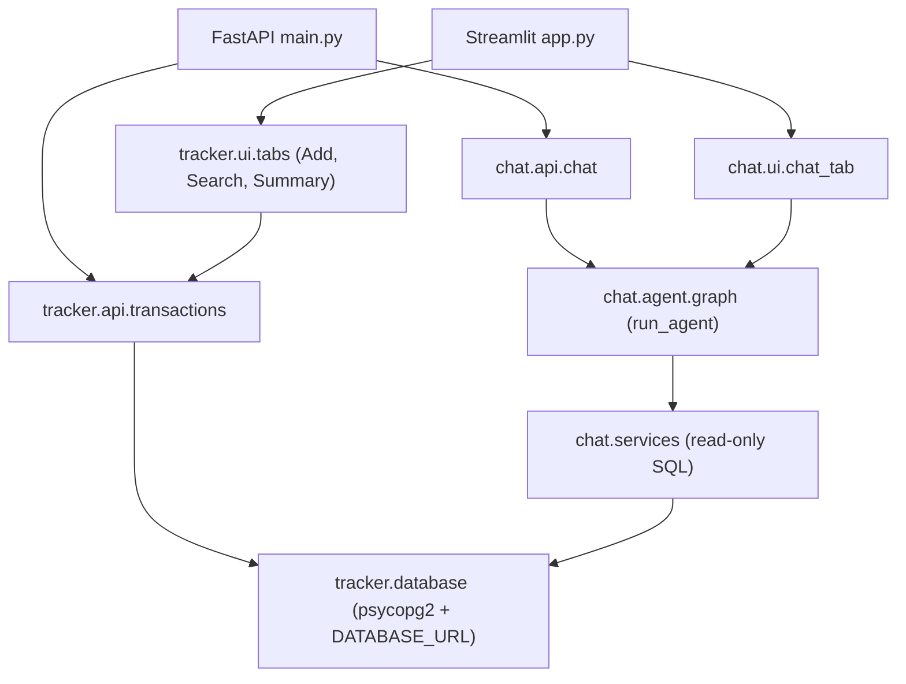

## Architecture Overview

This project is organized around two feature packages — **tracker** and **chat** — plus a small **common** package for shared utilities.

- **common/**: shared logging configuration.
- **tracker/**: all transaction CRUD, validations, CSV import/export, FastAPI routes, and Streamlit UI tabs for Add/Search/Summary.
- **chat/**: the LangGraph-based finance assistant (agent), its FastAPI APIs, and the Streamlit Chat tab.

Both tracker and chat use the same PostgreSQL database via a single **`DATABASE_URL`** environment variable. There is **no Supabase client** in the runtime path; Supabase is only a convenient way to host Postgres if you choose.

### Runtime components

- **FastAPI (`main.py`)**
  - Mounts `tracker.api.transactions` for all `/transactions` and `/summary` endpoints.
  - Mounts `chat.api.chat` for `/chat/invoke`, `/chat/resume`, and `/chat/exit`.
- **Streamlit (`app.py`)**
  - Uses `common.logger.get_logger` to configure logging on startup.
  - Renders three main tabs:
    - `tracker.ui.tabs.add_txn_tab.render_add_transaction`
    - `tracker.ui.tabs.search_tab.render_search`
    - `chat.ui.chat_tab.render_chat`
  - The `tracker.ui.tabs.summary_tab` module exists but its tab is currently hidden in the UI.

### Tracker package (`tracker/`)

- `database.py`: thin psycopg2 layer over `DATABASE_URL`, providing:
  - `get_connection()`
  - CRUD helpers like `create_transaction`, `get_transaction`, `list_transactions`, `update_transaction`, `delete_transaction`
  - Aggregation and search helpers such as `get_summary` and `query_transactions`
- `schemas.py`: Pydantic models for request/response payloads and internal use.
- `constants.py`: fixed list of allowed categories and any other domain constants.
- `validations.py`: shared validation helpers (amount > 0, category required, date not in future, etc.).
- `services.py`: CSV-related logic:
  - Export to CSV based on search filters.
  - Provide a CSV template with correct headers.
  - Import rows from CSV using `tracker.database` and `tracker.schemas`.
- `api/transactions.py`: FastAPI router exposing:
  - CRUD endpoints for `/transactions`
  - Current-month summary at `/summary`
- `ui/`:
  - `common.py`: shared Streamlit helpers and common error messaging.
  - `tabs/summary_tab.py`, `tabs/add_txn_tab.py`, `tabs/search_tab.py`: page-level layout and interactions.
  - `utils/import_csv_section.py`, `utils/search_filters.py`, `utils/search_results.py`: reusable UI pieces for CSV import, filters, and results table.

### Chat package (`chat/`)

- `services.py`: read-only SQL executor using psycopg2 and `DATABASE_URL`, with guards to:
  - Enforce SELECT-only queries.
  - Limit result size and protect against dangerous SQL.
- `agent/`:
  - `graph.py`: constructs the LangGraph graph and exposes `run_agent`.
  - `nodes.py`: defines the core agent node and tool orchestration.
  - `tools.py`: tools for listing tables, inspecting schema, and executing safe SQL.
  - `state.py`: the agent state (e.g., messages list).
  - `prompt.py`: system prompt and instructions for the agent.
  - `llm.py`: Gemini LLM wrapper and configuration.
- `api/chat.py`: FastAPI router for:
  - `POST /chat/invoke` → calls `run_agent` with the provided chat history and returns `{ "reply": "..." }`.
  - `POST /chat/resume` → stub endpoint signalling that resume is not yet implemented.
  - `POST /chat/exit` → stub endpoint for ending a session.
- `ui/chat_tab.py`: Streamlit tab that calls the chat API or agent and displays the conversation.

### High-level flow

This layout is designed so that:

- The **database integration** is centralized in `tracker.database` and `chat.services`.
- **Feature code** for transactions and chat lives in separate, clearly named packages.
- **UI layers** (FastAPI and Streamlit) depend on feature packages, not the other way around.

