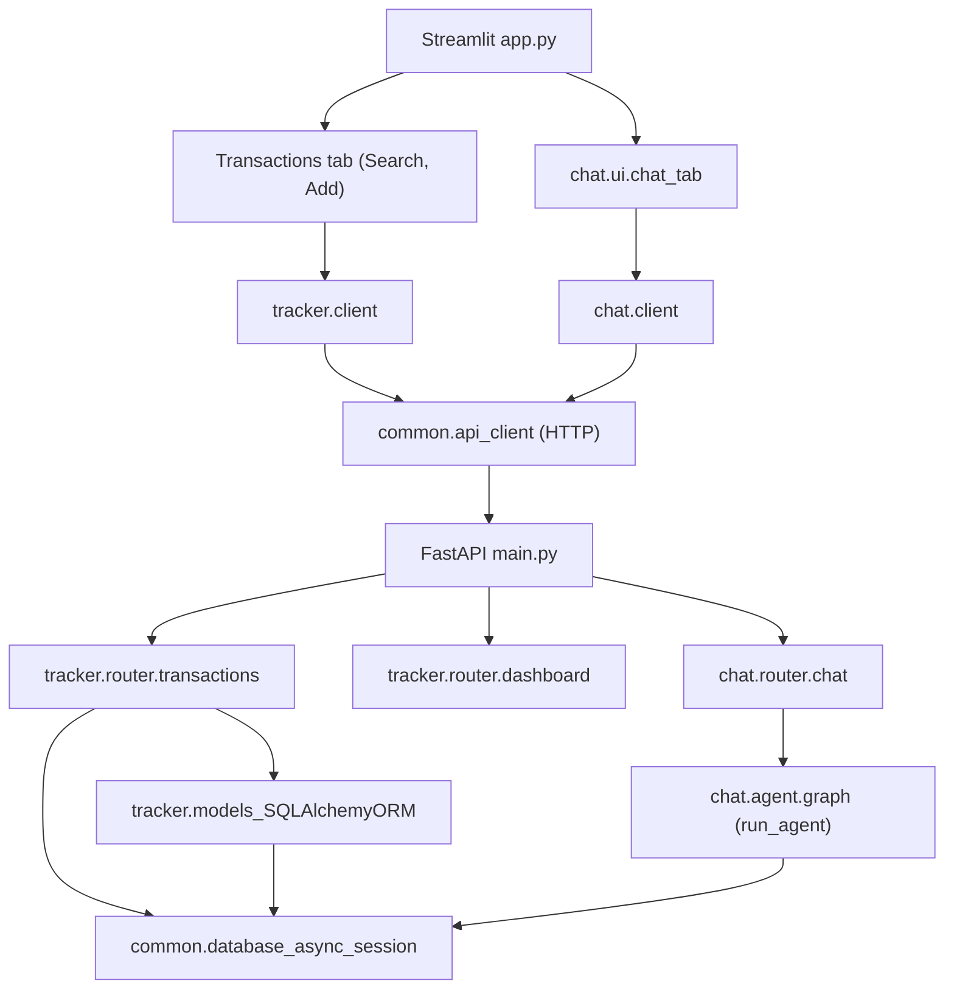

## Architecture Overview

This project is organized around two feature packages — **tracker** and **chat** — plus a small **common** package for shared utilities.

- **common/**: shared logging and SQLAlchemy async database engine/session helpers.
- **tracker/**: all transaction CRUD, validations, CSV import/export, FastAPI routes, and Streamlit UI tabs for Add/Search.
- **chat/**: the LangGraph-based finance assistant (agent), its FastAPI APIs, and the Streamlit Chat tab.

Both tracker and chat use the same PostgreSQL database via a single **`DATABASE_URL`** environment variable. There is **no Supabase client** in the runtime path; Supabase is only a convenient way to host Postgres if you choose.

### Runtime components

- **FastAPI (`main.py`)**
  - Includes `tracker.router.transactions` for `/transactions` endpoints.
  - Includes `tracker.router.dashboard` for `/dashboard/overview` (single consolidated overview endpoint).
  - Includes `chat.router.chat` for `/chat/invoke`, `/chat/resume`, and `/chat/exit`.
- **Streamlit (`app.py`)**
  - Uses `common.logger.get_logger` to configure logging on startup.
  - Renders three main tabs:
    - `Overview` tab: `tracker.ui.tabs.dashboard_tab.render_dashboard_overview`
    - `Transactions` tab: `tracker.ui.tabs.search_tab.render_search` and `tracker.ui.tabs.add_txn_tab.render_add_transaction`
    - `Chat` tab: `chat.ui.chat_tab.render_chat`
  - Communicates with FastAPI exclusively over HTTP via the client layer (`tracker.client`, `chat.client`, and `common.api_client`).
### Common package (`common/`)

- `database.py`: shared SQLAlchemy async DB utilities — `get_database_url()`, `get_async_database_url()`, `is_database_configured()`, `get_async_engine()`, `get_sessionmaker()`, `get_connection()`, `get_db_session()`.
- `logger.py`: shared logging configuration.
- `api_client.py`: shared HTTP client used by Streamlit tabs (`tracker.client`, `chat.client`) to talk to the FastAPI app. Configured via `API_BASE_URL` (default `http://localhost:8000`), raising `ApiClientError` on non-2xx responses.

### Tracker package (`tracker/`)

- `models.py`: SQLAlchemy ORM models (`Base`, `Transaction`) mapped to `transactions`.
- `schemas.py`: Pydantic models for request/response payloads and internal use.
- `constants.py`: fixed list of allowed categories and any other domain constants.
- `validations.py`: shared validation helpers (amount > 0, category required, date not in future, etc.).
- `services.py`: async CSV and dashboard data logic using SQLAlchemy async sessions and ORM/text queries.
- `router/transactions.py`: async FastAPI router exposing CRUD endpoints for `/transactions` (search, export, import, create, update, delete) using SQLAlchemy ORM + async session.
- `router/dashboard.py`: FastAPI router exposing a single overview endpoint under `/dashboard/overview`.
- `client.py`: HTTP client wrapper around the `/transactions` API (`search_transactions`, `create_transaction`, `export_transactions_csv`, `import_transactions_csv`, `update_transaction`, `delete_transaction`); used by the Streamlit Add and Search tabs.
- `ui/`:
  - `common.py`: shared Streamlit helpers and common error messaging.
  - `tabs/dashboard_tab.py`: overview page with summary cards, monthly insights, and 6-month spending trend chart.
  - `tabs/add_txn_tab.py`, `tabs/search_tab.py`: page-level layout and interactions.
  - `utils/import_csv_section.py`, `utils/search_filters.py`, `utils/search_results.py`: reusable UI pieces for CSV import, filters, and results table.

#### Dashboard chart notes

- The spending trend chart in `tracker.ui.tabs.dashboard_tab` uses Altair with Streamlit `width="stretch"` rendering.
- The y-axis is explicitly controlled with a domain of `[0, max_spend + 30000]` to provide fixed headroom over current data.
- Bar values are sanitized to finite numeric values before charting to avoid rendering failures from invalid inputs.

### Chat package (`chat/`)

- `agent/`:
  - `graph.py`: constructs the LangGraph graph and exposes `run_agent`.
  - `nodes.py`: defines the core agent node and tool orchestration.
  - `tools.py`: `list_tables`, `get_table_schema`, `query_checker`, `execute_query`, `get_current_date`; `execute_query` uses async SQLAlchemy session from `common.database.get_connection()`.
  - `db_config.py`: table names and schema text for the agent.
  - `schema.py`: Pydantic `args_schema` models for tools.
  - `state.py`: the agent state (e.g., messages list).
  - `prompt.py`: system prompt and instructions for the agent.
  - `llm.py`: Gemini LLM wrapper and configuration.
- `router/chat.py`: FastAPI router for:
  - `POST /chat/invoke` → calls `run_agent` with the provided chat history and returns `{ "reply": "..." }`.
  - `POST /chat/resume` → stub endpoint signalling that resume is not yet implemented.
  - `POST /chat/exit` → stub endpoint for ending a session.
- `client.py`: HTTP client wrapper for the chat API (`chat_invoke`, `chat_resume`, `chat_exit`); used by the Streamlit Chat tab.
- `ui/chat_tab.py`: Streamlit tab that calls the chat API via `chat.client` and displays the conversation.

### High-level flow

This layout is designed so that:

- The async **engine/session lifecycle** is centralized in `common.database`; tracker routes/services use SQLAlchemy ORM and the chat agent runs SQL via async session execution.
- **Feature code** for transactions and chat lives in separate, clearly named packages.
- **UI layers** (FastAPI and Streamlit) depend on feature packages via HTTP APIs and shared clients, not the other way around.

