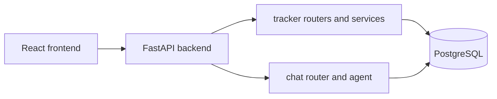

## Architecture Overview

Parsel uses a clear split:

- `backend/` for FastAPI APIs, domain logic, and database access.
- `frontend/` for the React UI.

The API is stateless and directly calls feature services.

## Backend structure

- `backend/main.py`: FastAPI app setup, CORS, router registration.
- `backend/common/`: shared database and logging utilities.
- `backend/tracker/`: transactions, dashboard services, constants, schemas, routers.
- `backend/chat/`: chat agent graph and chat API routes.
- `backend/tests/`: backend tests.

## Frontend structure

- `frontend/src/App.tsx`: app shell and route navigation.
- `frontend/src/pages/OverviewPage.tsx`: dashboard view.
- `frontend/src/pages/SearchPage.tsx`: searchable transaction ledger with edit/delete/export.
- `frontend/src/pages/AddPage.tsx`: transaction create form and CSV import.
- `frontend/src/pages/ChatPage.tsx`: chat UI with invoke/resume/exit flow.
- `frontend/src/api/`: fetch wrappers for API calls.

## Runtime flow

## API boundaries

- Tracker
  - `/config/tracker`
  - `/transactions/*`
  - `/dashboard/overview`
- Chat
  - `/chat/invoke`
  - `/chat/resume`
  - `/chat/exit`

## Stitch integration notes

- MCP config is stored in `.cursor/mcp.json`.
- Design payload files are expected in `docs/design/`.
- Frontend uses fallback route mapping in `docs/design/stitch-route-map.md` until full Stitch payloads are retrieved.
